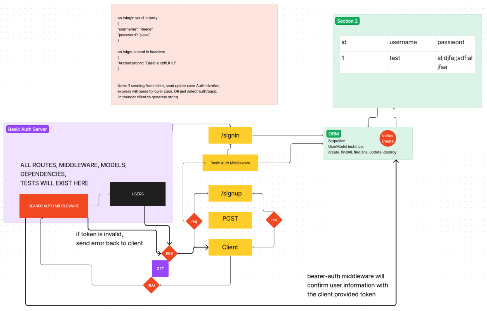

# LAB - Class 07

Project: Bearer Auth

Author: Reece

Problem Domain

Build off our existing auth-server ability to create an account and handle basic authentication.  This server builds on that with utilizing tokens to re-authenticate users to shield routes that require a valid login.

Links and Resources

  [PR for Lab Original Submission](https://github.com/ReeceRenninger/bearer-auth/pull/1)
  [GitHub Actions ci/cd](https://github.com/ReeceRenninger/bearer-auth)
  back-end server url (when applicable)
  
Collaborators

-

Setup

- PORT=your-choice
- DATABASE_URL=postgres://localhost:5432/db.name
- SECRET=your-secret-is-here

How to initialize/run your application (where applicable)

    e.g. npm start

How to use your library (where applicable)
Features / Routes

    Feature One: Details of feature
    GET : /hello - specific route to hit

Tests

    How do you run tests?
    Any tests of note?
    Describe any tests that you did not complete, skipped, etc

UML

